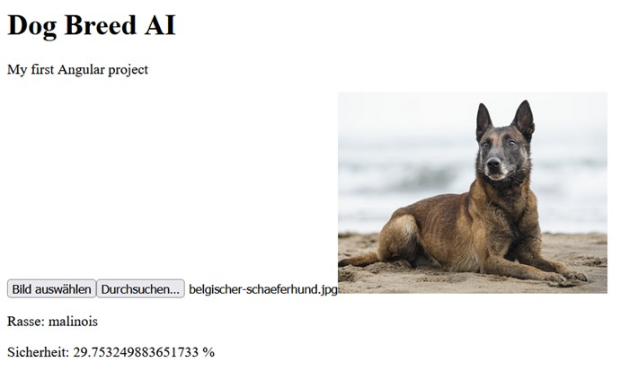

# DogBreedAI

DogBreedAI is a personal learning project that combines modern web development with AI-powered services.

The application allows users to upload a dog image, automatically identify the dog breed using an AI image classification model, and generate a short description of the breed using a language model.

## Project Status

This project is currently in active development.

The image upload workflow, image preview, ASP.NET Core backend, and Hugging Face integration have already been implemented.

The currently integrated dog breed classification model is being evaluated and will likely be replaced with a more accurate alternative, as the prediction quality is not yet reliable enough for real-world usage.

## Current Features

* Upload a dog image
* Image preview in the browser
* AI-powered dog breed recognition using Hugging Face
* Angular frontend connected to an ASP.NET Core Web API

## Planned Features

* Improved dog breed recognition model
* Automatic breed description generation
* Responsive user interface

## Tech Stack

### Frontend

* Angular
* TypeScript
* HTML
* CSS

### Backend

* ASP.NET Core Web API
* C#

### AI Services

* Hugging Face Inference API
  * Image Classification Model
  * Text Generation Model

## Setup

A Hugging Face API token is required to run the AI integration.

Store the token using .NET User Secrets:

```bash
dotnet user-secrets set "HuggingFace:ApiToken" "YOUR_TOKEN"
```

## Future Enhancements

* Entity Framework Core
* SQL Server
* User accounts
* Analysis history
* Favorites and saved results


<p align="center">
  
</p>
