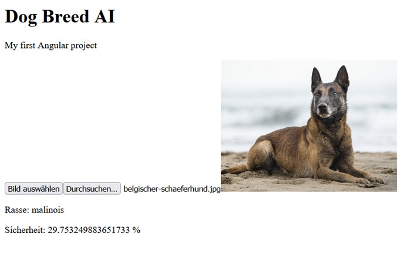

# DogBreedAI

### AI-powered dog breed recognition and description


DogBreedAI is a web application that identifies dog breeds from uploaded images using an AI image classification model and automatically generates a short breed description using a language model.

## Features

* Upload a dog image
* Image preview in the browser
* AI-powered dog breed recognition using Hugging Face
* Automatic breed description generation using Hugging Face
* Angular frontend connected to an ASP.NET Core Web API
  
## Tech Stack

### Frontend

* Angular
* TypeScript
* HTML
* CSS

### Backend

* ASP.NET Core Web API
* C#

### AI Services

* Hugging Face Inference API
* Image Classification Model
* Text Generation Model

## Setup

A Hugging Face API token is required to run the AI integration.

Store the token using .NET User Secrets:

```bash
dotnet user-secrets set "HuggingFace:ApiToken" "YOUR_TOKEN"
```


